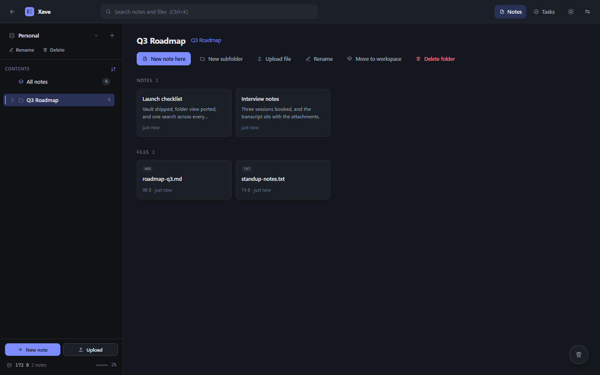
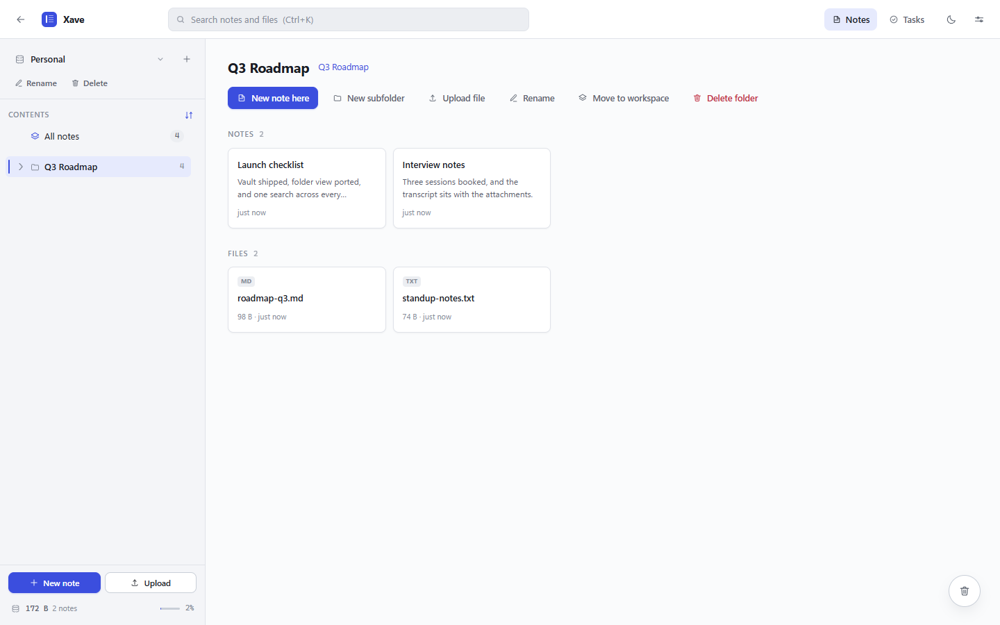
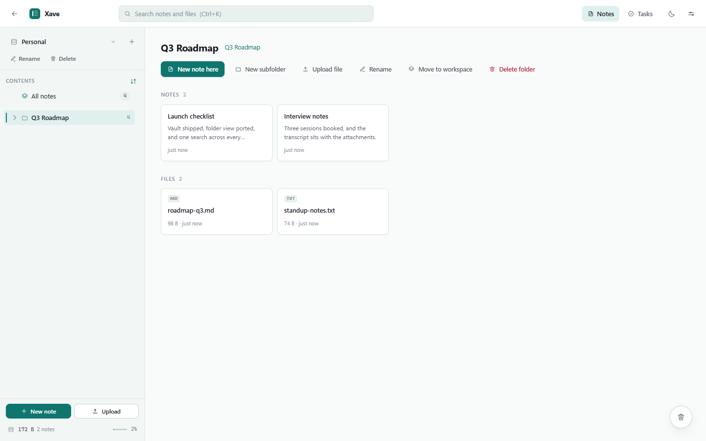
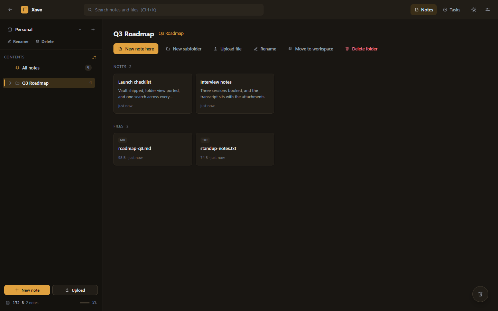
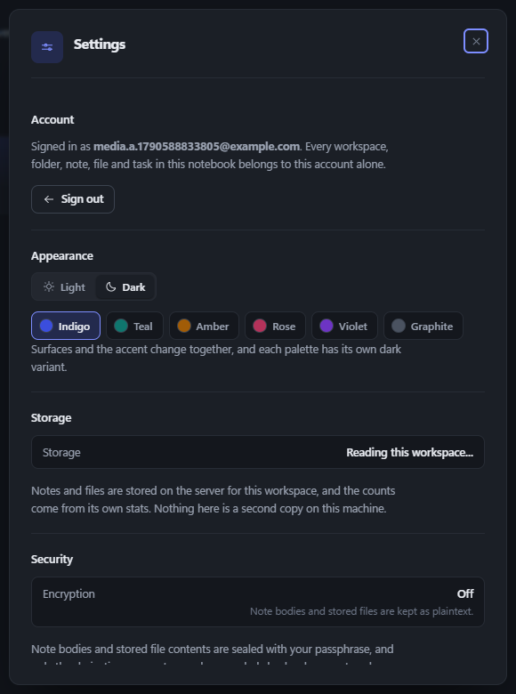
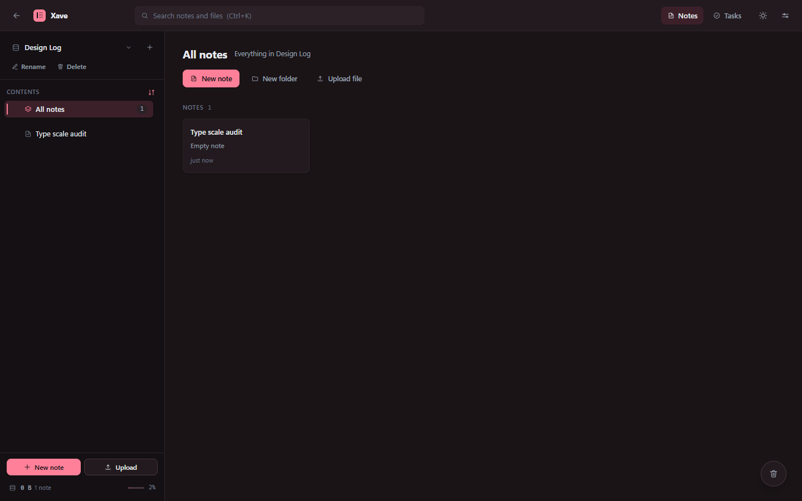
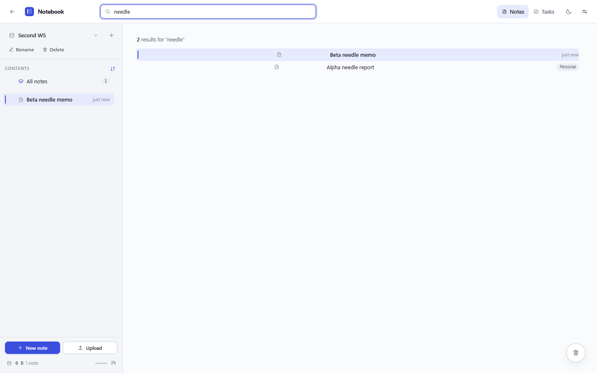
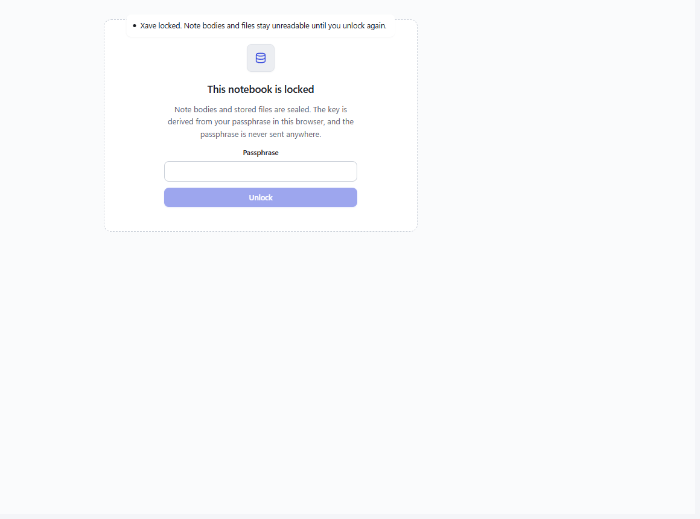
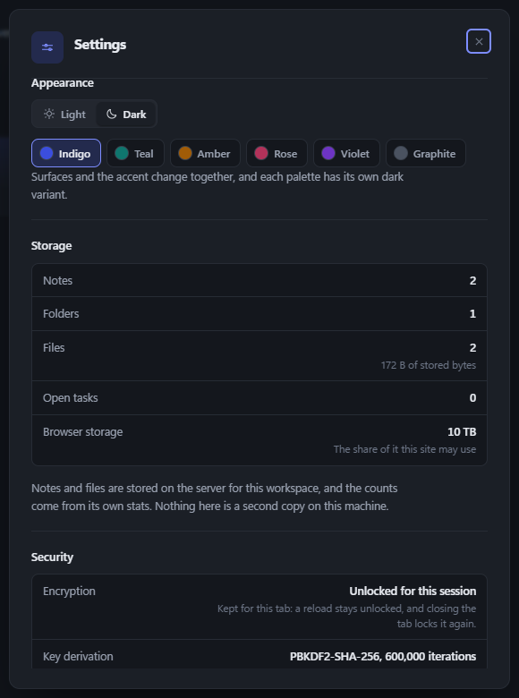

# Xave

[](https://github.com/xvrpdlla2026/Xaveme/actions/workflows/tests.yml)

A notes app you host yourself: workspaces, nested folders, notes, file attachments, a task list,
and a vault that seals note bodies in the browser before they are ever sent.



## A look at it

Both modes, the six palettes, more than one account, and the vault. Every image below is the real
app, taken from a driven browser rather than mocked up.

| Light | Dark |
|---|---|
|  |  |

| Teal, light | Amber, dark |
|---|---|
|  |  |

Six palettes (indigo, teal, amber, rose, violet, graphite), each with its own dark variant, and
one token layer underneath: a palette is a token change, not a component rewrite.

## Accounts, kept apart

Every workspace, folder, note, file and task belongs to one account, and the API never reads a row
without checking the owner. The image on the right is a second account in the same browser: its own
workspaces, its own palette, and no sight of the first account's rows. A cross-account isolation
test in the suite holds that line.

| The account, and the way out | A different account, in the same browser |
|---|---|
|  |  |

## Search

One search across every workspace you own, from the header. Each hit names the workspace it came
from, and opening one moves there first.



## What it does

- **Workspaces.** Separate notebooks switched from the rail, each with its own tree, task list,
  trash and storage readout.
- **Folders and notes.** Nested to any depth, moved by drag or by menu, ordered by hand or by name
  and date. Notes autosave, and a folder lists its contents as cards.
- **Files.** Attached to a folder or a note, allowlisted by extension and MIME, written to the
  private disk, and streamed back through an authorized route, so a stored file never has an open
  URL.
- **Tasks.** A per-workspace list with priority, due dates and a done state.
- **Appearance.** Light and dark, six palettes, one token layer under the rail, the tree, the pane
  and the preview.

## The vault

Encryption happens in the browser. The passphrase is stretched with PBKDF2-SHA256 (600,000
iterations) using a salt stored beside the data, and note content is sealed with AES-GCM into an
`enc:v1:` envelope before it is ever sent. The server stores the envelope, the salt, the iteration
count and one sealed known string it can neither read nor forge. Losing the passphrase means losing
those notes, by design.

| Locked: the way back in | Settings: what is sealed, and what is not |
|---|---|
|  |  |

What the server actually holds for a sealed note. This is a real response, shortened for the page;
the stored value for that note was 163 characters:

```json
{
  "title": "Board minutes",
  "encrypted": true,
  "content": "enc:v1:UJXlLoXs7jU9S0zhhjiS2Ui6L4rv08qlC..."
}
```

Because the server only ever holds ciphertext, a search while the vault is on matches titles and
file names, not note bodies, and the results say so.

Attachment bytes are a known exception: they are uploaded and stored as they are, and the vault
does not cover them. The upload path says so in the record it writes rather than labelling them
sealed.

## Stack

- Laravel 12 on PHP 8.2, Sanctum session cookies for auth
- React 19 and TypeScript, built with Vite
- SQLite by default (the migrations are portable to MySQL or PostgreSQL)
- Plain CSS with a token layer: light and dark themes, six colour palettes

## Requirements

PHP 8.2 or newer with the `pdo_sqlite` and `zip` extensions, Composer, Node 20 or newer, npm.

## Setup

```bash
composer install
cp .env.example .env
php artisan key:generate
php artisan migrate
npm install
```

Then run the API and the asset server in two terminals:

```bash
php artisan serve
npm run dev
```

Open http://127.0.0.1:8000 and create an account. For a production build, `npm run build` writes
the compiled assets to `public/build` and `php artisan serve` picks them up.

`php artisan serve` answers one request at a time, so a screen that loads several resources at once
queues them and looks slow. Set `PHP_CLI_SERVER_WORKERS=4` in `.env` before serving to give the
dev server a few workers.

To point the app at MySQL instead, set `DB_CONNECTION=mysql` and the `DB_*` values in `.env` and
run `php artisan migrate` again. Nothing in the application code is SQLite specific.

## Tests

```bash
php artisan test
```

The suite covers every endpoint group, the soft delete and purge paths, and a cross user isolation
test that proves one account can never read or write another account's rows. The same suite runs in
CI on every push to `main` and every pull request.

## Layout

| Path | What lives there |
|---|---|
| `app/Http/Controllers/Api/V1` | one controller per resource |
| `app/Http/Requests` | validation for every write |
| `app/Policies` | ownership rules, checked on every action |
| `resources/js/api` | typed client, one module per resource |
| `resources/js/components` | the shell, the tree, the folder view and the editor |
| `resources/js/panes` | tasks, trash, settings and the vault gate |
| `resources/css` | design tokens, then the component layers |
| `docs/api.md` | the endpoint contract the frontend is written against |

## Changelog

What each release holds: [CHANGELOG.md](CHANGELOG.md).

## License

MIT.
